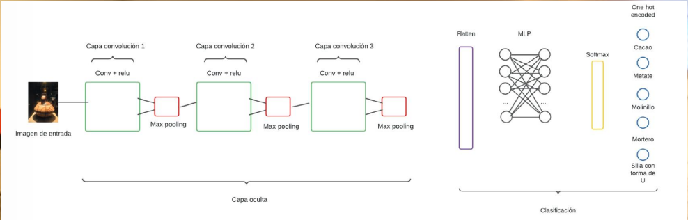

# Backend AI Guide

FastAPI backend to classify images using a neural network (Keras/TensorFlow). The service receives an image, processes it with a pre-trained model, and returns the identified category together with a related audio file, which is served as a static asset.



## Features
- FastAPI: quick API with automatic docs at `/docs`.
- TensorFlow/Keras: loads model (`modelo.h5`) and weights (`pesos.h5`).
- Image preprocessing: resize and array conversion via `Pillow`/Keras utils.
- Static files: audios served from `/audios`.
- Configurable CORS: allowed origins via environment variables.

## Project structure
```
backend-AI-guide/
├─ main.py
├─ modelo/
│  ├─ modelo.h5
│  └─ pesos.h5
├─ media/
│  ├─ audios/
│  │  ├─ cacao.mp3
│  │  ├─ metate.mp3
│  │  ├─ molinillo.mp3
│  │  ├─ mortero.mp3
│  │  └─ silla.mp3
│  └─ uploads/
│     └─ 205f08ba-e978-4189-9d9c-21c125e1e7cb.jpg
├─ requirements.txt
└─ README.md
```

## Requirements
- Python 3.10+
- pip / venv

## Installation
```bash
# 1) Create and activate a virtual environment (recommended)
python -m venv venv
# Windows PowerShell
venv\\Scripts\\Activate.ps1

# 2) Install dependencies
pip install -r requirements.txt
```

## Environment variables
Create a `.env` file in the project root to configure CORS:
```
ORIGIN_FRONTEND=http://localhost:5173
HOST_ORIGIN_FRONTEND=http://0.0.0.0:5173
```
Adjust the values to match your frontend origins.

## Run
```bash
# Run in development
fastapi dev main.py --host 0.0.0.0 --port 8000
```
- API base: `http://127.0.0.1:8000`
- Swagger docs: `http://127.0.0.1:8000/docs`
- Static files (audios): `http://127.0.0.1:8000/audios/<filename>`

## Endpoints
- `GET /` – Basic service status.
- `POST /uploadfile` – Accepts an image file (`multipart/form-data`) and returns the prediction.

### Example request (cURL)
```bash
curl -X POST "http://127.0.0.1:8000/uploadfile" \
  -H "accept: application/json" \
  -H "Content-Type: multipart/form-data" \
  -F "file=@path/to/your_image.jpg"
```

### Example response
```json
{
  "data": {
    "nombre": "Cacao",
    "audio": "/audios/cacao.mp3"
  }
}
```

## Model
Place your model and weights at `modelo/modelo.h5` and `modelo/pesos.h5`. The backend will load them when processing the image. Make sure they match the preprocessing used during training (size 100x100 according to `main.py`).

## Media and uploads
- Uploaded images are saved to `media/uploads/` with a unique filename.
- Audios are publicly served from `/audios` (mapped to `media/audios/`).

## Error handling
- The service returns clear messages when image loading/reading, model loading, or prediction fails.
- Check the server console logs for more details if errors occur.

## Development
- Interactive documentation: visit `/docs` when the server is running.
- Adjust CORS origins in `.env` to allow requests from your frontend.

## License
Adapt and reuse this project as needed. Add your license terms here if applicable.